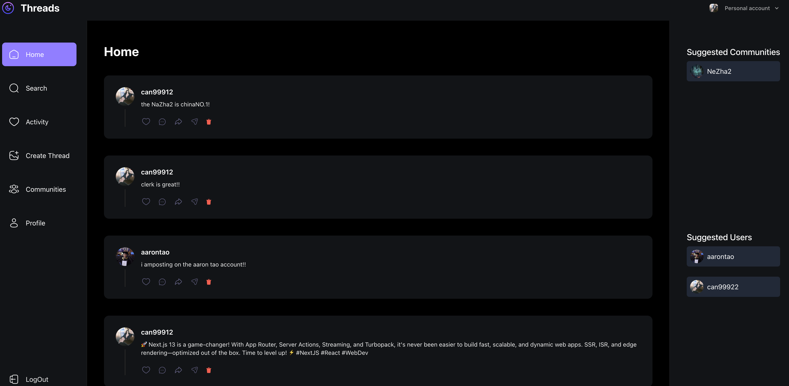
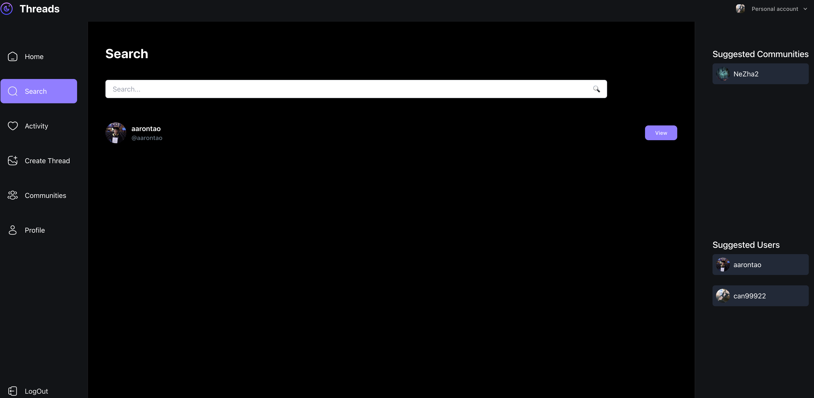
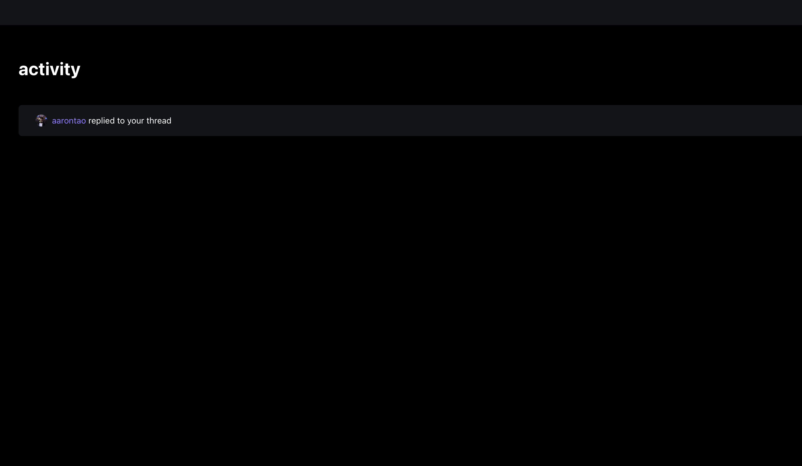
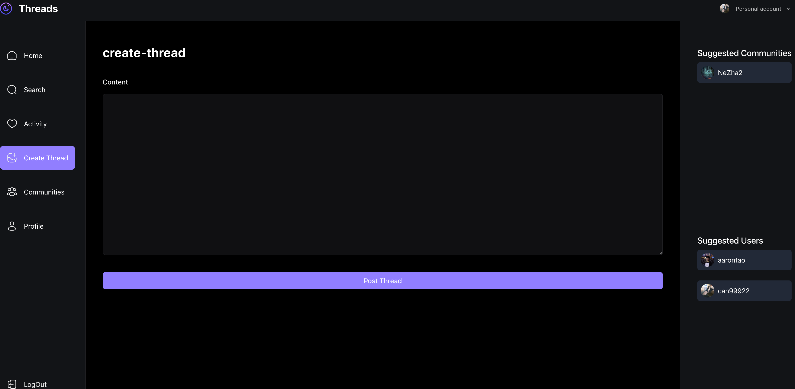
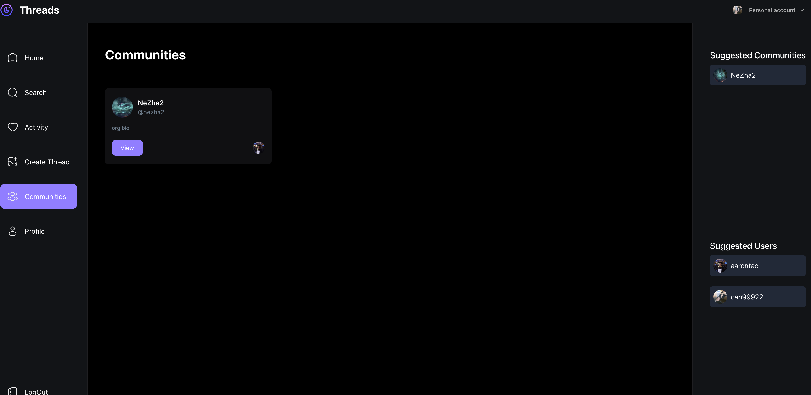
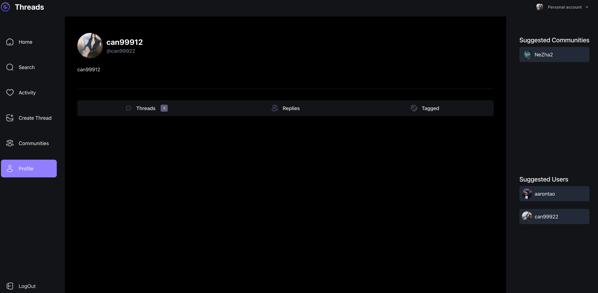

# 				***The Mock_Threads_APP***













# **Table Of Content**:

## Table of Contents

- [Description](#description)
- [Version](#version)
- [Prerequisites](#prerequisites)
- [Quick Start](#Quick_Start)
- [Features](#features)
- [Advanced Features](#Advanced_Features)
- [Project Architecture](#Project_Architecture)
- [Tech Stack](#Tech_Stack)
- [Resources](#resources)
- [Contact Information](#contact-information)
- [License](#license)


# **Description**

The Mock Threads can do lots of features like the real society application.

The Mock Threads app offers a range of features that mimic the functionality of real social media platforms, providing an engaging and interactive experience for users. Users can create threads, where they can post content, share their thoughts, or ask questions. These threads can be categorized by topics or communities, allowing users to find discussions that align with their interests.

In addition to creating threads, users can interact with others by liking posts, commenting, and reposting content. The app also includes a feature for sharing posts on external platforms, broadening the reach of popular discussions. The threading system allows for nested replies, making it easy for users to engage in focused conversations.

A key feature of the app is its social connectivity; users can follow other accounts, receive updates on new posts, and engage in private conversations through direct messages. Users can also customize their profiles with personal images and bio information, creating a more personalized experience.

# **Version**：

Version 1: the basic user,thread and communities functions

Version 2: make more improvements: social media link, repost, share etc...

# **Prerequisites**：

**Node.js**: To run this project, you need to have Node.js installed. The project is developed and tested on Node.js version `v18.0.0` and above. You can download the latest stable release from the [official Node.js website](https://nodejs.org/).

**Package Managers**: The project uses npm (which comes pre-installed with Node.js) or yarn for managing dependencies. If you prefer yarn, you can install it globally with the command `npm install -g yarn`. Using one of these package managers is essential for installing the necessary project dependencies.

**Clerk API Key**: Since the project integrates with Clerk for authentication, you'll need to obtain an API key from the [Clerk platform](https://clerk.dev/). After you get the key, use the `dotenv` package to securely store the API key as an environment variable in your local development setup.

**MongoDB**: This project requires MongoDB for backend data storage. You can install the [MongoDB Community Edition](https://www.mongodb.com/try/download/community) locally and ensure that it’s running. The `mongoose` library is used to interact with the database, and it is critical for backend data storage and retrieval.

**Backend Dependencies**: In the root directory of the project, run `npm install` to install the backend dependencies. These dependencies include libraries such as `axios` for making HTTP requests, `bcrypt` for hashing passwords, `express` for handling the backend server, and `mongoose` for interacting with MongoDB, all of which are specified in the `package.json` file.

**Frontend Dependencies**: For the frontend, navigate to the frontend directory and run `npm install`. This will install frontend dependencies such as `react` and `react-dom` for building user interfaces, as well as UI libraries like `@mui/material` for UI components, along with other necessary packages for styling and functionality.

# **Quick_Start**：

### **Clone the Repository**

- Open your terminal and navigate to the directory where you want to store the project. Then run the following Git command:

  ```
  git clone https://github.com/HAONANTAO/threads_app.git
  cd Mock_AI_ChatBot
  ```


### Install Dependencies

- For both the front-end and back-end, run `npm i` in the root project directory. This will install all the packages listed in the `dependencies` and `devDependencies` sections of the `package.json` files for both parts of the application.
- The back-end uses packages like `axios`, `bcrypt`, and `express` for handling HTTP requests, user authentication, and server setup respectively. The front-end depends on libraries such as `react`, `@mui/material` for building the user interface.

```
npm install
```


### Running the Code

- Start the Backend first then running the Frontend.

  ```
  npm run dev
  ```

  

# **Features**：

👉 **Post & Thread Management:**

- You fetch posts (threads) by pagination, ensuring top-level threads are retrieved.
- Threads can have comments (children), and the system supports recursion to fetch all replies.
- You can create, delete, and fetch individual threads, including all child threads and their replies.

**👉User Management:**

- You can fetch, update, and manage user profiles (including bio, image, and name).
- The system supports fetching posts made by the user and replies (thread interactions).
- User search supports pagination and sorting based on creation date.

**👉Community Management:**

- Communities can be created, members added, and posts within communities are fetched with threads and their respective replies.
- The system allows searching for communities by name or username, with pagination support.
- You handle community memberships by adding/removing users from communities.


# **Advanced_Features**：

more features are comming......

(share thread, repost thread, social media......)

# **Project_Architecture**：

/project-root

│── .next

│── .vercel

│── .env.local

│── .gitignore

│── components.json

│── middleware.ts

│── next-end.d.ts

│── next.config.js       # Next.js configuration file
│── package.json         # Project dependencies and scripts

│── postcss.config.mjg

│── tailwind.config.ts

│── tsconfig.json      

│── package-lockl.json         # Project dependencies and scripts

│── tsconfig.json        # TypeScript configuration
│── .eslintrc.js         # ESLint configuration
│── .prettierrc          # Prettier configuration
│── README.md            # Project documentation

│── /public              # Static assets (images, fonts, etc.)


│── /components   # Reusable React components

│──│──cards

│──│── │──CommunityCard.tsx

│──│── │──ThreadCard.tsx

│──│── │──UserCard.tsx

│──│──forms

│──│── │──AccountProfile.tsx

│──│── │──Comment.tsx

│──│── │──PostThread.tsx

│──│──shared

│──│── │──Bottombar.tsx

│──│── │──DeleteButton.tsx

│──│── │──LeftSidebar.tsx

│──│── │──ProfileHeader.tsx

│──│── │──RightSidebar.tsx

│──│── │──SearchBar.tsx

│──│── │──ThreadsTab.tsx

│──│── │──Topbar.tsx

│──│──ui   

│──│── │──button.tsx

│──│── │──form.tsx

│──│── │──input.tsx

│──│── │──label.tsx

│──│── │──tabs.tsx

│──│── │──textarea.tsx   

│── /app

│──│──(auth)

│──│──(root)

│──│──api

│──│──favicon.ico

│──│──globals.css

│── /constants             # Feature-based modules (business logic, API integration)

│──│──index.js

│── /lib               # Custom actions

│──│──actions

│──│──models

│──│──validations

│──│──mongoose.ts

│──│──uploadthing.ts

│──│──utils.ts


# **Tech_Stack**：

- This project utilizes the following technologies:

  ### Frontend

  - **Next.js** (`next`): A React framework for building fast, scalable, and static websites. This app is built with Next.js for server-side rendering and static generation.
  - **React** (`react`, `react-dom`): A JavaScript library for building user interfaces with a component-based architecture.
  - **Tailwind CSS** (`tailwindcss`, `tailwind-merge`, `tailwindcss-animate`): A utility-first CSS framework for rapid UI development, including animations and responsive designs.
  - **Radix UI** (`@radix-ui/react-label`, `@radix-ui/react-slot`, `@radix-ui/react-tabs`): A set of low-level UI primitives that provide accessibility and customization.
  - **Lucide React** (`lucide-react`): A collection of open-source, customizable icons for React applications.
  - **Zod** (`zod`): A TypeScript-first schema declaration and validation library for ensuring data integrity.
  - **React Hook Form** (`react-hook-form`, `@hookform/resolvers`): A form library for handling complex form logic with minimal re-renders, combined with schema validation via Zod.
  - **Clerk** (`@clerk/clerk-sdk-node`, `@clerk/nextjs`, `@clerk/themes`): A set of authentication tools for handling user authentication and management seamlessly within the application.

  ### Backend

  - **MongoDB** (`mongodb`, `mongoose`): A NoSQL database used for data storage and management. Mongoose is used for creating models and interacting with MongoDB in an elegant way.
  - **Svix** (`svix`): A solution for managing webhooks, ensuring that your app can process and react to events from external services.

  ### Development Tools

  - **TypeScript** (`typescript`): A superset of JavaScript that enables static typing, improving code quality and maintainability.
  - **PostCSS** (`postcss`): A tool for transforming CSS with JavaScript plugins, enabling features like autoprefixing and optimizing CSS.
  - **Autoprefixer** (`autoprefixer`): A PostCSS plugin for automatically adding vendor prefixes to CSS rules.
  - **Class Variance Authority** (`class-variance-authority`): A utility for generating dynamic class names based on different states or props.
  - **Clsx** (`clsx`): A tiny utility for constructing `className` strings conditionally.

# **Resources**：

video Link:https://www.youtube.com/watch?v=O5cmLDVTgAs

# **Contact Information**：

Aaron(HAONAN) TAO

email:873190199@qq.com

github:https://github.com/HAONANTAO

linkin:https://www.linkedin.com/in/haonan-tao-aaron

# **License**：

This project is licensed under the MIT License, which is detailed as follows:

## MIT License Text

Permission is hereby freely granted to any individual or entity that obtains a copy of this software, along with its associated documentation files (collectively referred to as the "Software"). Recipients have unrestricted rights to engage with the Software. This includes, but is not limited to, the rights to use, duplicate, adapt, merge, publish, disseminate, sublicense, and even sell copies of the Software. Moreover, those who receive the Software are also permitted to carry out the same actions, subject to the conditions below.

It is mandatory that the above-mentioned copyright notice and this permission notice be incorporated into all copies, or any substantial segments, of the Software.

The Software is offered on an "as is" basis. There are no warranties of any kind, whether expressed or implied. This encompasses, but is not restricted to, warranties regarding merchantability, suitability for a specific purpose, and non-infringement. Under no circumstances shall the authors or copyright holders be held accountable for any claims, damages, or other liabilities. These could arise from actions related to contracts, torts, or other legal causes, and be directly or indirectly connected to the Software, or any activities performed using it.

By opting for the MIT license, our intention is to foster an open, collaborative development ecosystem. Developers are at liberty to fork the project, enhance it, and integrate it into their own undertakings, provided that they preserve the relevant copyright notices. This license is favored for its straightforwardness and permissive nature, which spurs a diverse array of contributions from the open-source community. Whether you're an independent coder eager to experiment with the code, or a large enterprise looking to build upon our groundwork, the MIT license endows you with the necessary freedom.

